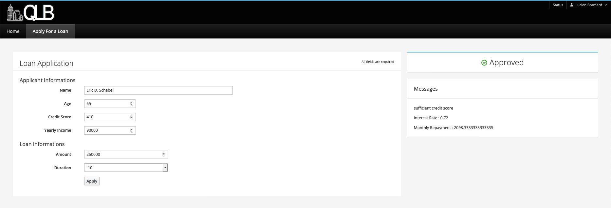
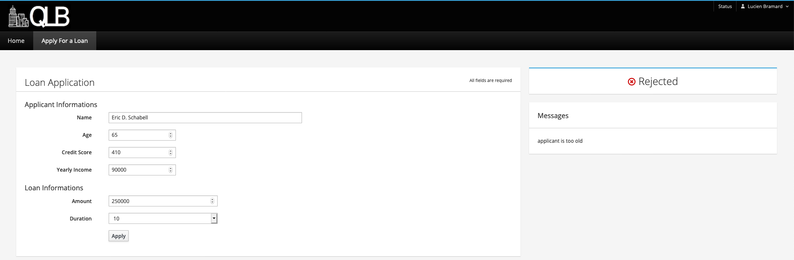
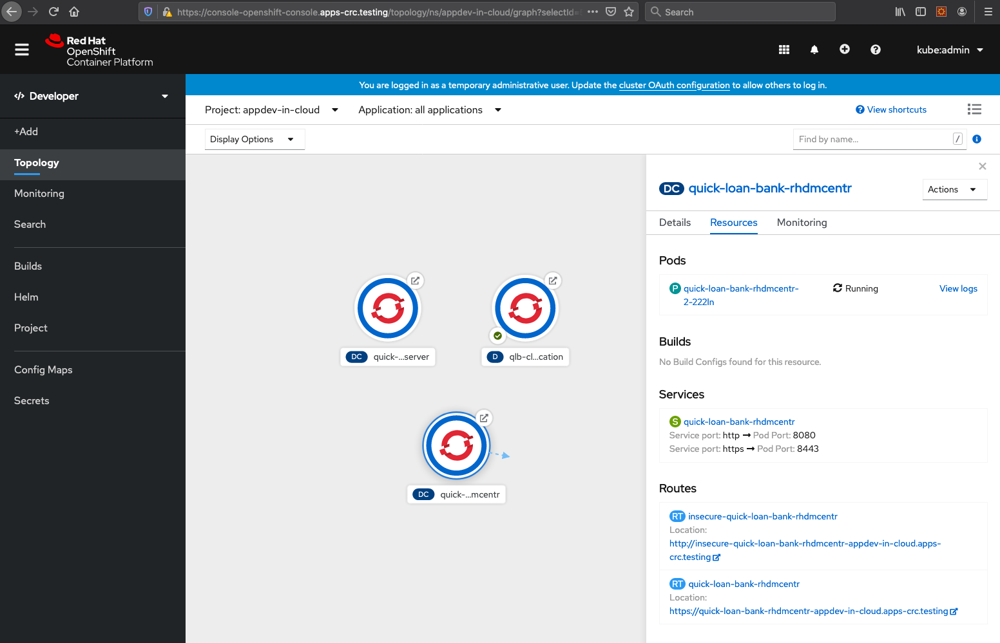
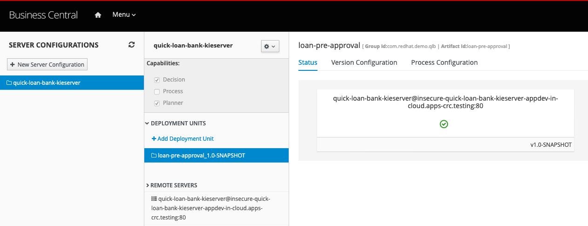

CodeReady Containers Quick Loan Bank Demo
==========================================
This demo project showcases the tooling available in Red Hat Decision Manager implementing 
complex decision logic which can be exposed as a decision service. The Quick Loan Bank in this 
demo uses technical rules, decision tables, guided rules with a Domain Specific Language, and 
Excel decision tables to define its loan calculation and approval system.

You will be given examples of calling the rules as if using them from an application through 
the RestAPI that is exposed by the server. Furthermore, this demo provides a Node.js client 
application written in AngularJS and PatternFly that showcases how web applications can 
consume decision services deployed on the decision server.

This demo installs the Red Hat Decision Manager on OpenShift Container Platform on your local
machine. It's leveraging CodeReady Containers and delivers a fully functioning container-native 
development experience.


Install on CodeReady Containers 
--------------------------------
There are two options to install and run this project on the OpenShift Container Platform (OCP) 
using your own existing installation or install on CodeReady Containers which provides you with 
a local OCP cluster.

1. Ensure you have a CodeReady Containers installation:

  - your own CodeReady Containers installation, if using this you just need to set the variables 
    to point to it in init.{sh|bat} script.

  - [CodeReady Containers Easy Install](https://gitlab.com/redhatdemocentral/ocp-install-demo)

2. [Download and unzip this demo.](https://gitlab.com/redhatdemocentral/crc-quick-loan-bank-demo/-/archive/master/crc-quick-loan-bank-demo-master.zip)

3. Run 'init.sh' or 'init.bat' file. 'init.bat' must be run with Administrative privileges:

```
   # If using the CodeReady Containers installation, just ensure a correctly set cluster 
   # address for the HOST_IP variable found at the top of the init.{sh|bat} files, for example:
   #
   # HOST_IP=api.crc.testing  
   # 
   # Now just run the script without any arguments and it picks up that hostname as follows:
   #
   $ ./init.sh
```

Now log in to Red Hat Decision Manager to start developing containerized process automation 
projects (the address will be generated by OCP):

  - CodeReady Container example: 
    https://crc-quick-loan-bank-demo-appdev-in-cloud.apps-crc.testing ( u:erics / p:redhatdm1! )

Not sure how to get started with Red Hat Decision Manager? Try one of these 
<a href="https://bpmworkshop.gitlab.io/#/4" target="_blank">online workshops</a> to build 
a first project from scratch.

Running the demo
----------------
1. Log in to the decision manager business central dashboard at:
   http://insecure-quick-loan-bank-rhdmcentr-appdev-in-cloud.apps-crc.testing with u:erics 
   and p:redhatdm1!

2. Click on the "loan-pre-approval" project to open the decision project.

2. The project has simple data model (Loan & Applicant) and single decision table 
   (loan-pre-approval) which contains the loan approval rule set.

3. Build and deploy version 1.0 of the project. Click on the "Build and Deploy" in the 
   upper right corner.

4. Go to "Menu -> Deploy -> Execution Servers" repository to see the 'loan-pre-approval_1.0-SNAPSHOT' 
   KIE Container deployed on the Decision Server.

5. The decision server provides a Swagger UI that documents the full RESTful interface exposed 
   by the server at: http://insecure-quick-loan-bank-kieserver-appdev-in-cloud.apps-crc.testing/docs

6. In the Swagger UI:
   - navigate to "KIE Server and KIE containers"
   - expand the "GET" operation for resource "/server/containers"
   - click on "Try it out"
   - leave the parameters blank and click on "Execute"
   - when asked for credentials use: Username: erics, Password: redhatdm!
   - observe the response, which lists the KIE Containers deployed on the server and their 
     status (STARTED, STOPPED).

7. We can use the Swagger UI to test our Loan Approval Decision Service. In the Swagger UI:
   - navigate to "KIE session assets"
   - expand the "POST" operation for resource "/server/containers/instances/{id}"
   - click on "Try it out"
   - set the "id" parameter to the name of the KIE Container that hosts our rules, in this 
     case `loan-pre-approval_1.0-SNAPSHOT`.
   - set "Parameter content type" to `application/json`.
   - set "Response content type" to `application/json`
   - use the following request as the "body" parameter. Note that the `Loan` object has 
     its `approved` attribute set to `false`:

   ```
   {
      "lookup": "default-stateless-ksession",
      "commands": [
         {
            "insert": {
               "object": {
                  "com.redhat.demo.qlb.loan_pre_approval.model.Applicant": {
                     "creditScore":410,
                     "name":"Billy Bob",
                     "age":40,
                     "yearlyIncome":90000
                  }
               },
               "out-identifier":"applicant"
            }
         },
         {
            "insert": {
               "object": {
                  "com.redhat.demo.qlb.loan_pre_approval.model.Loan": {
                     "amount":250000,
                     "duration":10
                  }
               },
               "out-identifier":"loan"
            }
         },
         {
            "start-process" : {
               "processId" : "loan-pre-approval.decision-flow",
               "parameter" : [ ],
               "out-identifier" : null
            }
         }
      ]
   }
   ```

   - observe the result. The Quick Loan Bank rules have fired and determined that, based 
     on the credit score of the application, and the amount of the loan, the loan can be 
     approved. The `approved` attribute of the `Loan` has been set to `true`.


Running demo with frontend UI
-----------------------------
1. Log in to the decision manager business central dashboard at: 
   http://insecure-quick-loan-bank-rhdmcentr-appdev-in-cloud.apps-crc.testing
   with u:erics and p:redhatdm1!

2. Click on the "loan-pre-approval" project to open the decision project.

2. The project has simple data model (Loan & Applicant) and single decision table 
   (loan-pre-approval) which contains the loan approval rule set.

3. Build and deploy version 1.0-SNAPSHOT of the project. Click on the "Build and Deploy" in the 
   upper right corner.

4. Go to "Menu -> Deploy -> Execution Servers" repository to see the 'loan-pre-approval_1.0-SNAPSHOT' 
   KIE Container deployed on the Decision Server.

5. Open the deployed Quick Loan Bank application form: 
   http://qlb-client-application-appdev-in-cloud.apps-crc.testing

6. Fill in the form as follows and submit for evaluation (approved, right?):

   ```
   Name: Eric D. Schabell
   
   Age: 65

   Credit Score: 410

   Yearly Income: 90000

   Amount: 250000

   Duration: 10
   ```

7. Open Business Central in another tab, open the project "loan-pre-approval", and open the 
   rule eligibility-too-old-applicant. Change the maximum age to 60. Save and close the file.

8. Deploy the project again by clicking the Deploy button.

9. Submit the same loan reqeust as above in the frontend application. It should now be rejected
   as your age is over the limit of 60 you just updated in your rules.

Feel free to explore different rule changes and form submission values to see how the decision
logic (rules) are now externalized from your deployed application (frond end UI).


Notes:
-----
If for any reason the installation breaks or you want a new Red Hat Decision Manager 
installation, just remove the project appdev-in-cloud entry in the OpenShift console 
and re-run the installation.


Supporting Articles
-------------------
- [CodeReady Containers - Exploring a Node.js Front End with Decision Management Back End](https://dzone.com/articles/codeready-containers-exploring-a-nodejs-front-end)


Released versions
-----------------
See the tagged releases for the following versions of the product:

- v1.1 - Supporting CodeReady Container 1.19.0 with OpenShift Container Platform 4.6.3 using 
  Red Hat Decision Manager 7.8 and Node.js provided container images to automatically install 
  the Quick Loan Bank demo.

- v1.0 - Supporting CodeReady Container 1.15.0 with OpenShift Container Platform 4.5 using 
  Red Hat Decision Manager 7.7 and Node.js provided container images to automatically install 
  the Quick Loan Bank demo.












